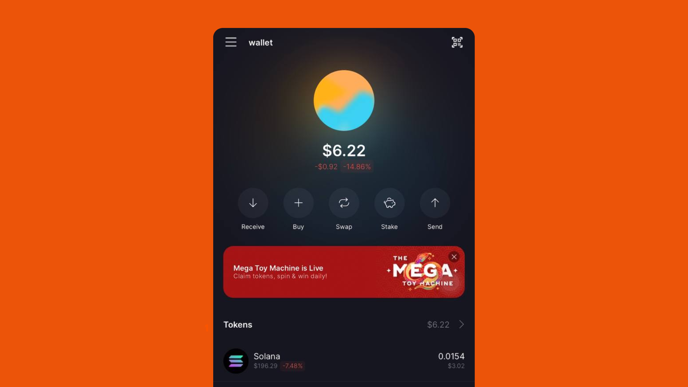
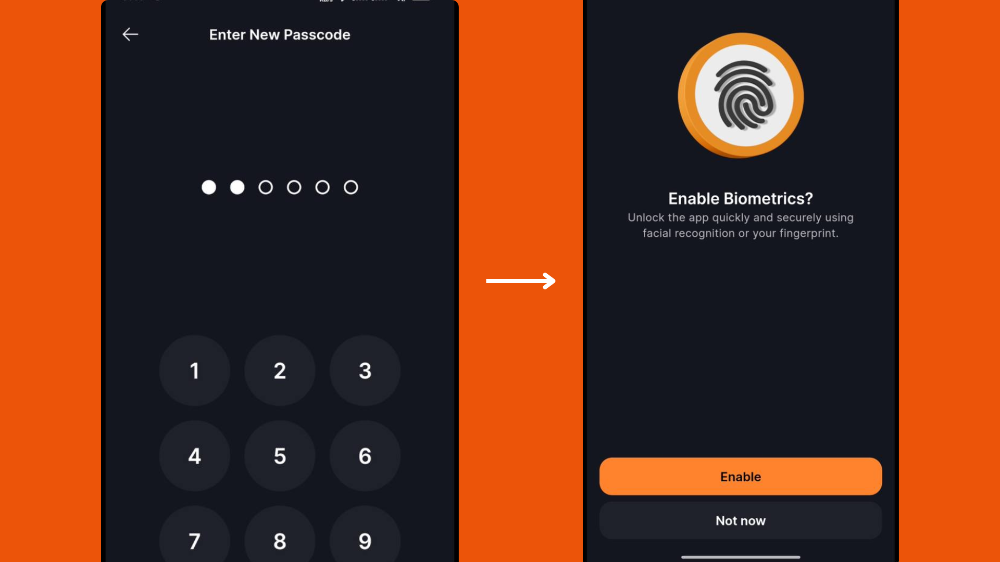
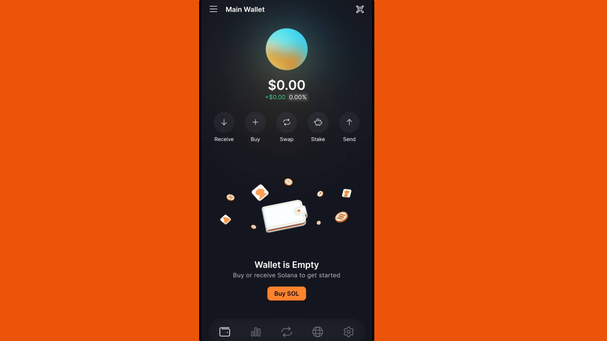

# Import any Solana Wallet on solfare

Importing your existing Solana wallet into Solflare allows you to manage your assets within Solflare's user-friendly interface. You can do this using either your wallet's **private key** or **recovery phrase**.&#x20;


**Important:** Your private key and recovery phrase are sensitive pieces of information that grant full access to your funds. Handle them with utmost care and ensure they remain confidential.


_**Below are step-by-step instructions for both methods.**_

***

## **Method 1: Importing Using a Private Key**


_Note: This method is applicable if your current wallet provides access to the private key._


### **1. Export the Private Key from Your Current Wallet:**

* Open your wallet extension.
* Click on the **Settings** icon (usually located at the bottom right).
* Navigate to **Manage Accounts** and select **Show Private Key**.
* Enter your wallet password when prompted.
* Your private key will be displayed; copy it securely.

### **2. Import into Solflare:**

Open your Solflare wallet&#x20;

Click on the Menu Icon icon at the top left then click Edit

<figure><figcaption></figcaption></figure>

Select the IMPORT PRIVATE KEY

Enter a name for the imported wallet.

Click the paste Icon to paste the private key you previously copied and click Import Button to proceed.

<figure><figcaption></figcaption></figure>

Your wallet is now successfully imported into Solflare. You can switch between accounts using the wallet management panel.

<figure><figcaption></figcaption></figure>

***

## **Method 2: Importing Using a Recovery Phrase**


_Note: This method is suitable if your current wallet does not provide access to the private key but offers a recovery phrase (also known as a mnemonic phrase)._


### **1. Obtain the Recovery Phrase from Your Current Wallet:**

* Open your existing Solana wallet.
* Access the **Settings** menu.
* Locate the option to **Export Recovery Phrase**.
* Follow the prompts to view and securely copy your recovery phrase.

### **2. Import into Solflare:**

Open the Solflare wallet application and select the _**Restore Wallet Button.**_

<figure><figcaption></figcaption></figure>

Paste or enter your recovery phrase and click the Continue Button.

<figure><figcaption></figcaption></figure>

* Set a new password for your Solflare wallet and also enable notifications to get alerts.

<figure><figcaption></figcaption></figure>

Your wallet is now imported into Solflare, and you can manage your assets seamlessly.

<figure><figcaption></figcaption></figure>

_Reference:_ [_How to switch to Solflare from another Solana wallet?_](https://help.solflare.com/en/articles/9260340-how-to-switch-to-solflare-from-another-solana-wallet)

***

### **Security Tips:**

* Never share your private key or recovery phrase with anyone.
* Store your private key and recovery phrase securely, preferably offline.
* Be cautious of phishing attempts and ensure you're using official wallet applications.

[\
](https://docs.solflare.com/solflare/onboarding/mobile/connect-a-ledger-wallet)
