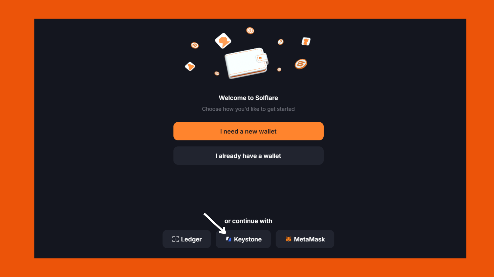

# Import Your Keystone Device

Keystone firmware versions M-6.0 (Multi-Coin) or newer enables the Solflare Web App (v1.29 or newer) to be used with your Keystone and sets the extension as a **watch-only** wallet for your **Keystone Essential or Keystone Pro** device.

Before going through the steps in this guide, make sure you’ve upgraded your Keystone [firmware](https://keyst.one/firmware?locale=en) to versions M-6.0 (Multi-Coin) or newer. Please read [How to upgrade firmware](https://support.keyst.one/getting-started/firmware-upgrading) for more details.

### **Step 1: Access Solflare**

Go to Solflare.com and click **Access Wallet**.

<figure><figcaption></figcaption></figure>

Click the **Keystone** icon on the main page.

<figure><figcaption></figcaption></figure>

### **Step 2: Set Your Keystone to Watch-only Mode**

1. On your Keystone device, tap the **Menu icon**.
2. Tap **Watch-only Wallet** on the device screen.
3. Select **Solflare / Slope** from the options and tap **Confirm**.

#### **Step 3: Scan the Keystone QR Code**

1. Scan the **Keystone QR code** using your computer’s camera to connect.
2. Select the accounts you wish to import, then tap **Continue**.
3. Set a password for your Solflare wallet, then click **Continue**.

### **You're Done!**

Congratulations! Your **Keystone Hardware Wallet** has now been successfully connected to Solflare, and you can easily manage your assets securely from the Web App.
