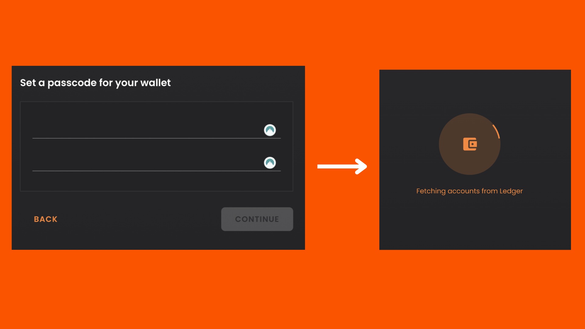

# Import Your Ledger Device

This guide shows you how to connect a funded Ledger account to your Solflare wallet. It assumes you already have a wallet setup on a Ledger device and there is a SOL balance on at least one account.

If you haven’t done that yet, you can set up a new wallet using the Ledger Live app by following the steps in [this guide](https://academy.solflare.com/guides/how-to-generate-a-wallet-with-a-ledger-device-using-the-ledger-live-app-mobile/).

### Step 1: Connect Your Ledger to Your Computer 

Plug your Ledger device into your computer via USB.

<figure><figcaption></figcaption></figure>

### Step 2: Enter Your PIN and Select the Solana Application 

Enter your PIN code on the Ledger device and select the **Solana** application.&#x20;

You’ll see the message **Application is ready** appear on the screen.

####

<figure><figcaption></figcaption></figure>

### **Step 3: Access the Solflare Web Wallet**

* Open [Solflare’s website](https://solflare.com/) and select **Access Web Wallet** or **Access**.

<figure><figcaption></figcaption></figure>

### **Step 4: Choose Continue with Ledger**

Click on the option **Continue with Ledger** to proceed.

<figure><figcaption></figcaption></figure>

### **Step 5: Open the Solana App and Continue**

Ensure the Solana app is still open on your Ledger device. Click **Continue** on Solflare when you're ready to proceed.

<figure><figcaption></figcaption></figure>

***

### **Step 6: Confirm Device Connection**

Your browser will notify you that a device is attempting to connect to Solflare.com.&#x20;

Select the Ledger device you want to connect to and click **Connect**.

<figure><figcaption></figcaption></figure>

***

### **Step 7: Set a Passcode for Your Wallet**

Set a passcode to protect your Solflare wallet and click Continue Button

Solflare will begin fetching your accounts from Ledger.

<figure><figcaption></figcaption></figure>

***

### **Step 8: Select a Derivation Path**

Choose the derivation path with SOL in it, then click **Continue**.

<figure><figcaption></figcaption></figure>

### **Step 9: Enable Blind Signing for SPL Tokens and Smart Contracts**

To interact with SPL tokens and smart contracts, you need to enable blind signing on your Ledger device. Follow these steps:

1. **Unlock your Ledger device** and open the Solana application. The device should display **Application is ready**.
2. Navigate to **Settings** by pressing the right button, then press both buttons to validate.
3. Your device will show **Allow blind sign**. Select **Yes** and press both buttons. Your device will display **Application is ready** again, indicating that blind signing has been enabled.

### **Notes on Blind Signing**

* **Blind signing** is required for using Solana and is considered an advanced feature.
* It’s recommended to **disable blind signing** after use for security purposes.
* Keep in mind that **blind signing** may need to be enabled frequently when using Solana.
* **Firmware updates** or **Solana Live app updates** will automatically disable blind signing.

### You’re all set! 

Congratulations! You’ve successfully connected your Ledger device to Solflare and can now access your Solana wallet with ease.

<figure><figcaption></figcaption></figure>
